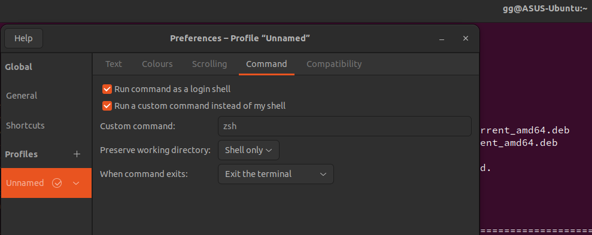

`sudo apt-get update`

## git
```
sudo apt-get install git
ssh-keygen -t ed25519 -C "email@gmail.com"
ssh-add ~/.ssh/id_ed25519
```
then add ssh to github

`git config --global user.email email@gmail.com`

## zsh

```
sudo apt-get install zsh -y
chsh -s $(which zsh) or see screenshot
```


then follow [terminal.md](terminal.md)

## node
```
sudo apt install nodejs
sudo apt install npm
```

## chrome
```
wget https://dl.google.com/linux/direct/google-chrome-stable_current_amd64.deb
sudo apt install ./google-chrome-stable_current_amd64.deb
google-chrome
```

## vscode

```
code --install-extension dbaeumer.vscode-eslint
code --install-extension eamodio.gitlens
code --install-extension EditorConfig.EditorConfig
code --install-extension esbenp.prettier-vscode
```
<<<<<<< Updated upstream
CMD shift P => user settings json
```
"editor.codeActionsOnSave": {
  "source.fixAll.eslint": true,
},
"eslint.alwaysShowStatus": true,
"editor.defaultFormatter": "dbaeumer.vscode-eslint",
```
=======

## touchpad

see [fusuma](https://github.com/iberianpig/fusuma) install, then startup
`sg input fusuma`

## ctrl+c/v

Install kinto.sh then use mac bindings
In VScode teminal add file->preferences->key shortcuts
```
      {
            "key": "ctrl+c",
            "command": "workbench.action.terminal.copySelection",
            "when": "terminalFocus"
        },
        {
            "key": "ctrl+v",
            "command": "workbench.action.terminal.paste",
            "when": "terminalFocus"
        },
        {
            "key": "ctrl+shift+c",
            "command": "workbench.action.terminal.sendSequence",
            "args": {
              "text": "\u0003"
            },
            "when": "terminalFocus"
        },
``` 

## nvidia to intel battery saving

`sudo prime-select nvidia`

to switch back to intel

`sudo prime-select intel`

to check which card is selected at the moment

`prime-select query`

>>>>>>> Stashed changes
